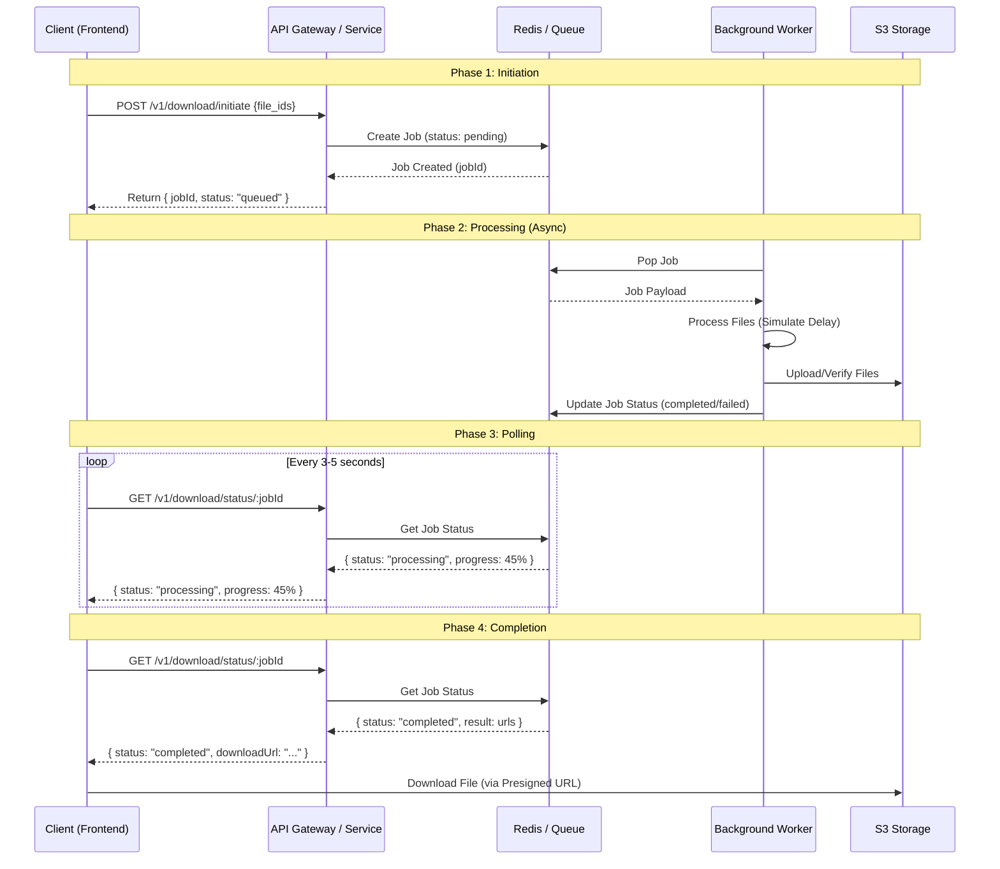

# Architecture Design: Long-Running Download System

## 1. Architecture Diagram



## 2. Technical Approach: Polling Pattern

I have chosen **Option A: Polling Pattern** for this implementation.

### Justification

1.  **Reliability**: Polling is stateless HTTP. It is robust against temporary network glitches, unlike WebSockets which require maintaining a persistent connection that can be fragile over mobile networks.
2.  **Proxy Compatibility**: "Cloudflare's 100s timeout kills long requests." Polling uses short, quick requests that easily fit within any standard timeout window (Cloudflare, Nginx, ALB).
3.  **Simplicity**: Easier to scale horizontally (stateless API servers) and simpler to debug than WebSocket state management.
4.  **Resilience**: If the user closes the tab, the server-side processing (Worker) continues uninterrupted. When they return (if session persists), they can re-poll the status.

## 3. Implementation Details

### API Contract Changes

**New Endpoints:**

- `GET /v1/download/jobs/:jobId`
  - **Response**:
    ```json
    {
      "jobId": "uuid",
      "status": "queued" | "processing" | "completed" | "failed",
      "progress": 0-100,
      "result": { "downloadUrl": "..." } // Only if completed
    }
    ```

### Database/Cache Schema (Redis)

Using Redis modules (or simple keys) for job state.
**Key**: `job:{jobId}`
**Value** (Hash):

- `status`: Current state.
- `created_at`: Timestamp.
- `file_ids`: List of files.
- `result`: JSON string of download info.

### Background Job Processing

- **Queue System**: **BullMQ** (Redis-based). Standard, reliable Node.js queue.
- **Worker**: A separate process (or logically separate service in Docker) that consumes the queue.
- **Concurrency**: Workers can scale independently of the API to handle load.

### Error Handling & Retries

- **Retries**: BullMQ supports automatic retries with exponential backoff for transient failures (e.g., S3 network blip).
- **Dead Letter Queue (DLQ)**: Failed jobs after N retries move to DLQ for manual inspection.
- **Timeouts**: Worker enforces a "processing visibility timeout" (e.g., 5 mins). If a worker crashes, the job becomes visible again for another worker.

## 4. Proxy Configuration

### Cloudflare / Nginx

Since we are using short-lived polling requests, we avoid the 100s timeout issue entirely.

**Nginx Config Example:**

```nginx
location /v1/download/jobs/ {
    proxy_pass http://backend;
    proxy_read_timeout 30s; # Standard timeout is fine for status checks
}
```

No special WebSocket upgrade headers or extreme timeout configurations are needed.

## 5. Frontend Integration (React/Next.js)

1.  **Initiate**: User clicks "Download". App calls `POST /initiate`. Receives `jobId`.
2.  **Poll Hook**: Custom hook `useJobPolling(jobId)` starts.
    - Uses `setInterval` (or `swr`/`react-query` with refresh interval) to call `GET /status`.
    - Interval: Start at 2s, maybe backoff to 5s if it takes longer.
3.  **Visuals**: Show a progress bar or spinner. "Preparing your download..."
4.  **Completion**: When status is `completed`, show "Download Ready" button or auto-trigger `window.location.href = downloadUrl`.
5.  **Recovery**: If user refreshes, check `localStorage` for pending `jobId` and resume polling.
